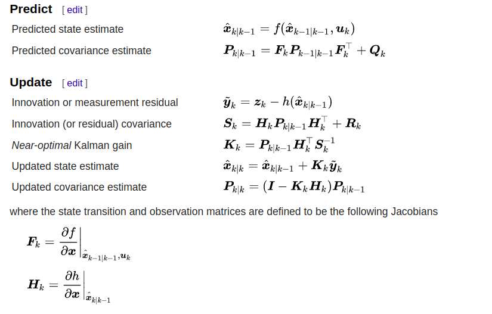
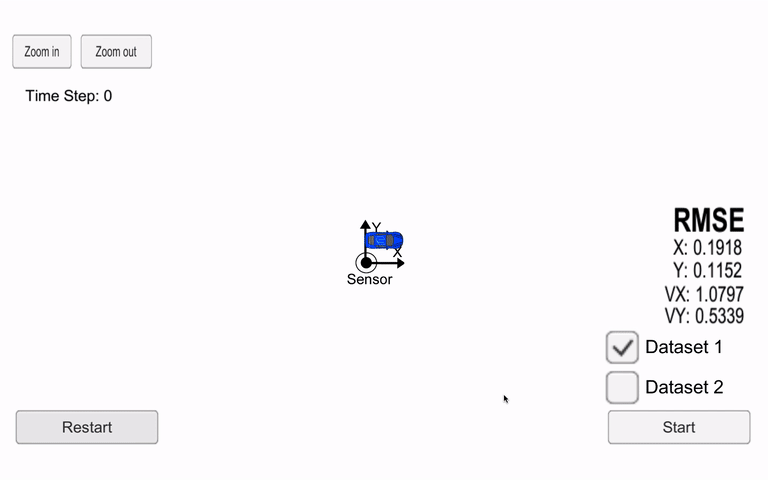

# Sensor Fusion with Extended Kalman Filter

In this project an Extended Kalman Filter(EKF) to estimate the state of a moving object with noisy lidar and radar measurements is built using C++. The measurements from lidar is fused with the measurements of radar to track the posiiton of the car. 

EKF is implemented to deal with the non-lineraties from the RADAR measurements. 
The equation for EKF implemented is presented below:

EKF filter consists of following steps:
<ul><li> Initialization</li>
	<li> Prediction</li>
	<li> Update </li></ul>

##Demo
The demo shows the position of blue car estimated using EKF fusing the measurements from LIDAR and RADAR.  The measurments is obtained from the simulator. The red circle represent LIDAR meaurements, blue circle is measurements from RADAR. These measurement is fused using EKF to estimate the location of the blue car represented by green triangle. The estimated position is compared with ground truth using RMSE.   

##Installation of Simulator
This project involves the Term 2 Simulator which can be downloaded [here](https://github.com/udacity/self-driving-car-sim/releases).

This repository includes two files that can be used to set up and install [uWebSocketIO](https://github.com/uWebSockets/uWebSockets) for either Linux or Mac systems. 

Once the install for uWebSocketIO is complete, the main program can be built and run by doing the following from the project top directory.

## Other Important Dependencies

* cmake >= 3.5
  * All OSes: [click here for installation instructions](https://cmake.org/install/)
* make >= 4.1 (Linux, Mac), 3.81 (Windows)
  * Linux: make is installed by default on most Linux distros
  * Mac: [install Xcode command line tools to get make](https://developer.apple.com/xcode/features/)
  * Windows: [Click here for installation instructions](http://gnuwin32.sourceforge.net/packages/make.htm)
* gcc/g++ >= 5.4
  * Linux: gcc / g++ is installed by default on most Linux distros
  * Mac: same deal as make - [install Xcode command line tools](https://developer.apple.com/xcode/features/)
  * Windows: recommend using [MinGW](http://www.mingw.org/)

## Basic Build Instructions

1. Clone this repo.
2. mkdir build
3. cd build
4. cmake ..
5. make
6. ./ExtendedKF

